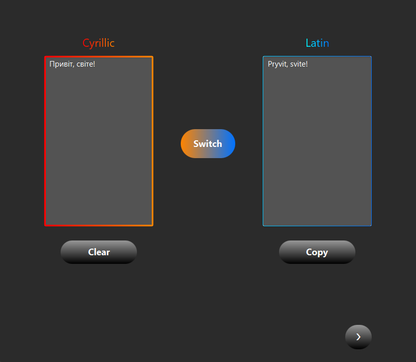
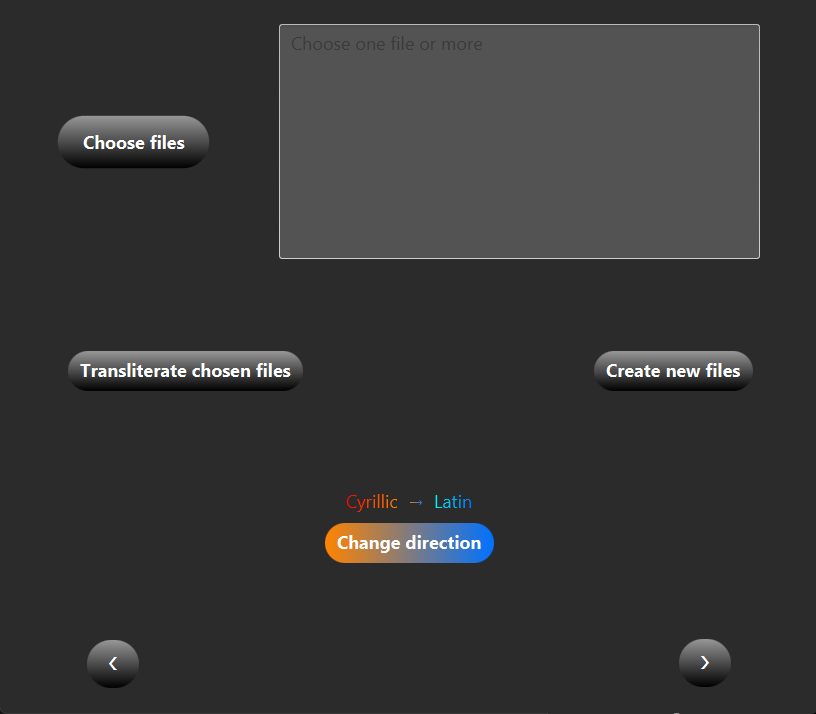
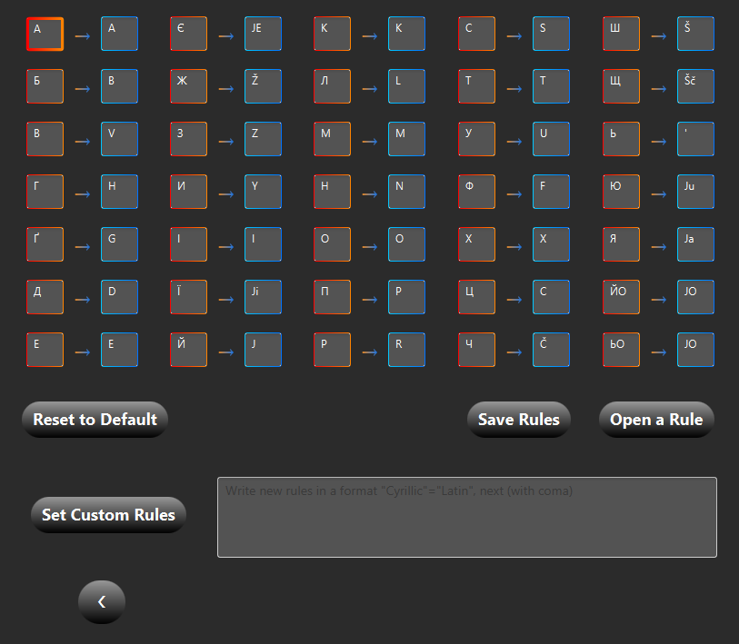

# Cyrillic To Latin Transliterator

> **"I want foreigners to be able to read Ukrainian"**

A powerful, configurable tool for transliterating Ukrainian (and other Cyrillic languages if configure) text between Cyrillic and Latin scripts.

### 1. 📝 The Translator (Text Editor)
A clean, dual-pane interface for quick text transliteration.
* **Bi-directional Support:** Instantly switch between Cyrillic $\rightarrow$ Latin and Latin $\rightarrow$ Cyrillic.
* **Smart Input:** Handles standard Ukrainian characters (Ґ, Є, І, Ї) and apostrophes.
* **Clipboard Integration:** Dedicated "Copy" and "Clear" controls for rapid workflow.
* **Visual Feedback:** Color-coded fields (Orange for Cyrillic, Blue for Latin) to prevent confusion.

### 2. 📂 The File Manager (Batch Processing)
Automate the transliteration of multiple documents at once.
* **Batch Processing:** Select and process multiple files of different formats simultaneously.
* **Non-Destructive:** Options to `Create new files` and `Overwrite originals`
* **Direction Toggle:** Easily switch the transliteration direction for the entire batch.

### 3. ⚙️ The Rules Manager (Configuration Engine)
The core power of the application. Unlike standard translators with hardcoded logic, **CyrillicToLatinAppUA** allows you to define *how* the language is interpreted.
* **Visual Grid Editor:** View and edit character mappings in an intuitive grid layout.
* **Complex Mapping Support:** Supports **One-to-Many** mapping (e.g., mapping `Щ` $\rightarrow$ `Šč` or `Є` $\rightarrow$ `Je`).
* **Custom Syntax:** Write manual rules using the format `"Cyrillic"="Latin"`.
* **Persistence:** Save your custom rulesets to a file and load them later (`Save Rules` / `Open a Rule`).
* **Reset Capability:** One-click restoration to the default standard Ukrainian transliteration.

## 🚀 Tech Stack

- **Language:** Java
- **UI Framework:** JavaFX
- **Styling:** Custom CSS
